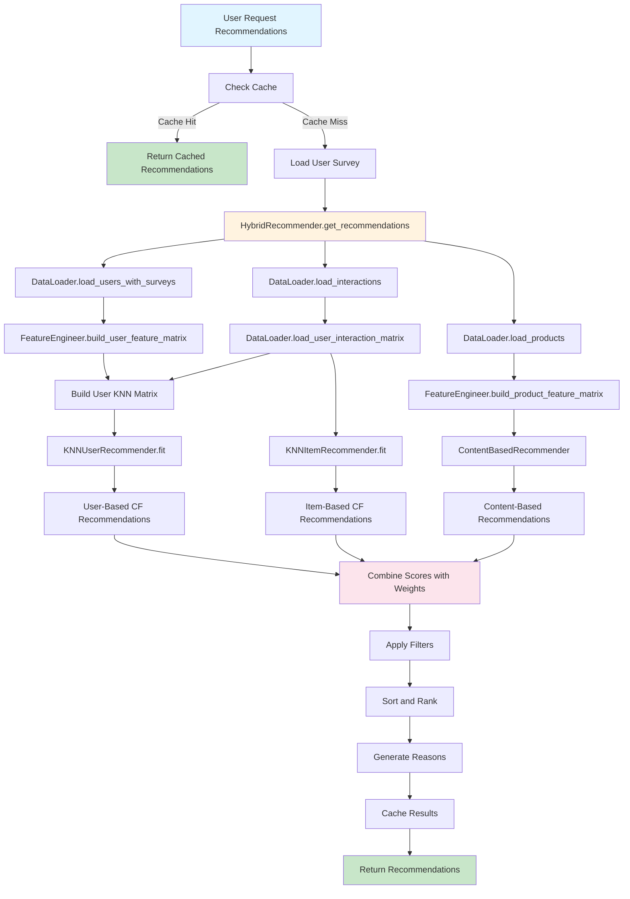
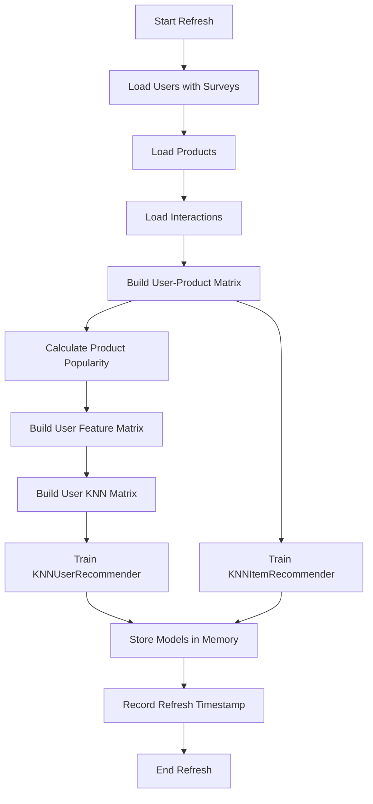
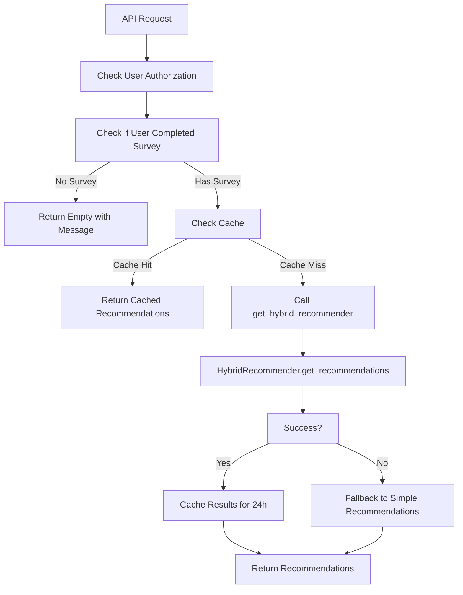

# KNN Recommendation Model - Complete Technical Explanation

## Overview

The guitar store recommendation system uses a **Hybrid K-Nearest Neighbors (KNN) approach** that combines three distinct recommendation strategies:

1. **User-Based Collaborative Filtering** - Finds users with similar behavior and recommends products they liked
2. **Item-Based Collaborative Filtering** - Finds products similar to those the user has interacted with
3. **Content-Based Filtering** - Recommends products based on user preferences (skill level, instrument type, genres)

This hybrid approach addresses the limitations of any single method and provides more accurate, diverse, and explainable recommendations.

## System Architecture Flow Chart



## Detailed Component Breakdown

### 1. Data Layer (DataLoader)

The `DataLoader` class is responsible for reading data from the SQLite database and preparing it for the ML models.

**Key Methods:**

- **load_users_with_surveys()**: Joins users table with user_surveys table to get user preferences
  - Returns: DataFrame with columns: user_id, skill_level, instrument_type, preferred_genres
  
- **load_products()**: Loads all products with their attributes
  - Returns: DataFrame with columns: id, name, category, price, stock, description, image_url, skill_level, genre_suitability, instrument_type, price_range
  - Parses genre_suitability JSON into a genres_list column

- **load_interactions()**: Loads user-product interaction history
  - Returns: DataFrame with columns: user_id, product_id, action, timestamp, duration, frequency
  - Actions are weighted: view=1, like=2, add_to_cart=3, purchase=5, compare=1.5

- **load_user_interaction_matrix()**: Creates a user-product matrix
  - Rows: user_ids
  - Columns: product_ids
  - Values: Aggregated action weights (sum of weighted interactions)
  - Keeps only the highest-weighted interaction per user-product pair

- **get_user_survey()**: Retrieves a specific user's survey responses
  - Returns: Dictionary with skill_level, instrument_type, preferred_genres

- **get_exclude_product_ids()**: Gets products to exclude from recommendations
  - Excludes products the user has purchased or added to cart (strong purchase signals)

### 2. Feature Engineering Layer (FeatureEngineer)

The `FeatureEngineer` class converts categorical data into numerical vectors that ML models can process.

**Feature Encoding Scheme:**

**User Survey Vector (13 dimensions):**
- Skill level (1 dim): Normalized 0-1 (beginner=0, intermediate=0.33, advanced=0.67, professional=1)
- Instrument type (3 dim): One-hot encoding [acoustic, electric, both]
- Preferred genres (9 dim): One-hot encoding for each genre [rock, blues, jazz, classical, metal, pop, country, folk, indie]

**Product Vector (17 dimensions):**
- Same as user vector (13 dim) PLUS:
- Category (4 dim): One-hot encoding [guitars, amplifiers, effects, accessories]

**Key Methods:**

- **build_user_feature_matrix()**:
  - Takes users DataFrame
  - Encodes each user's survey into a 13-dim vector
  - Applies StandardScaler to normalize features
  - Returns: (scaled_matrix, user_ids, scaler)

- **build_product_feature_matrix()**:
  - Takes products DataFrame
  - Encodes each product into a 17-dim vector
  - Applies StandardScaler to normalize features
  - Returns: (scaled_matrix, product_ids, scaler)

- **build_user_knn_matrix()**:
  - Concatenates scaled survey features with L2-normalized interaction history
  - This allows KNN to consider both user preferences AND behavior patterns
  - Returns: Combined matrix for user-user similarity

### 3. KNN Models Layer

#### 3.1 KNNUserRecommender (User-Based Collaborative Filtering)

**Purpose:** Find users similar to the target user and recommend products they liked.

**How it works:**
1. Takes the combined user matrix (survey features + interaction history)
2. Uses cosine distance to find k nearest neighbors (similar users)
3. For each similar user, looks at their positively interacted products
4. Aggregates recommendations weighted by similarity score

**Algorithm:**
```python
# Distance metric: Cosine similarity
# Algorithm: Brute force (exact, no approximation)
# Number of neighbors: Configurable (default 5)

# For each similar user:
similarity_weight = 1 / (cosine_distance + epsilon)
recommendation_score = similarity_weight * interaction_weight
```

**Output:** Dictionary of {product_id: (score, reason)}
- Reason: "Popular with shoppers who have similar tastes"

#### 3.2 KNNItemRecommender (Item-Based Collaborative Filtering)

**Purpose:** Find products similar to those the user has interacted with.

**How it works:**
1. Transposes the user-product matrix to get product-user matrix
2. L2-normalizes each product's interaction vector
3. For the target user, identifies their top interacted products (seed items)
4. For each seed item, finds k nearest neighbor products
5. Aggregates recommendations weighted by seed item weight and similarity

**Algorithm:**
```python
# Distance metric: Cosine similarity
# Number of neighbors: Configurable (default 10)
# Seed items: Top 5 products user interacted with (weight > threshold)

# For each seed product:
similarity = 1 - cosine_distance
recommendation_score = similarity * seed_interaction_weight
```

**Output:** Dictionary of {product_id: (score, reason)}
- Reason: "Similar to items you browsed or saved"

#### 3.3 ContentBasedRecommender (Content-Based Filtering)

**Purpose:** Recommend products based on attribute similarity to user preferences.

**How it works:**
1. Takes user's survey responses (skill, instrument, genres)
2. For each product in catalog:
   - Calculates genre overlap (Jaccard-like similarity)
   - Calculates instrument compatibility score
   - Calculates skill level compatibility score
   - Calculates cosine similarity between user vector and product vector
3. Combines these scores with weighted averaging
4. Filters out incompatible products (wrong instrument type, out of stock)

**Scoring Formula:**
```python
score = 0.39 * genre_overlap
     + 0.27 * instrument_match
     + 0.22 * skill_compatibility
     + 0.12 * cosine_similarity
```

**Compatibility Functions:**

- **Genre Overlap:** `len(user_genres ∩ product_genres) / max(len(user_genres), 1)`
- **Instrument Match:** 1.0 if compatible, 0.4 if not (both allows all)
- **Skill Compatibility:**
  - 1.0 if exact match
  - 0.85 if 1 level difference
  - 0.72 if product is beginner and user is higher
  - 0.35 if product is >1 level above user
  - 0.55 otherwise

**Output:** Dictionary of {product_id: (score, reason)}
- Reasons vary based on strongest factor:
  - "Strong genre match for your preferences"
  - "Fits your instrument type perfectly"
  - "Matches your genres, skill level, and instrument type"

### 4. Hybrid Recommender (HybridRecommender)

The `HybridRecommender` class orchestrates all three recommenders and combines their results.

**Initialization:**
- Singleton pattern (one instance per application)
- Thread-safe initialization with lock
- Loads data and trains models on first access via `refresh()`

**refresh() Method - Training Pipeline:**


**get_recommendations() Method - Inference Pipeline:**

1. **Check if models are loaded:** If not, call refresh()
2. **Load user survey:** Get user's preferences from database
3. **Get exclude list:** Products user has purchased or added to cart
4. **Determine user interaction weight:** Sum of user's interaction scores
5. **Adjust weights based on user activity:**
   - Low activity (<5): Increase content weight to 0.5 (cold start)
   - High activity (>80): Increase collaborative filtering weights
   - Normal: Use default weights (USER_CF_WEIGHT, ITEM_CF_WEIGHT, CONTENT_WEIGHT)

6. **Get recommendations from all three models:**
   - User CF: Get top 40 recommendations
   - Item CF: Get top 40 recommendations  
   - Content: Get all compatible products with scores

7. **Normalize scores:** Min-max normalization within each recommendation set
8. **Redistribute weights:** If any recommender returns no results, redistribute weights
9. **Combine scores:** Weighted sum of normalized scores
10. **Apply filters:**
    - Exclude purchased/cart items
    - Filter out-of-stock items
    - Apply popularity boost (5% of normalized popularity)
11. **Generate reasons:** Select reason from the recommender with highest contribution
12. **Sort and rank:** By score, then genre overlap, then price (tiebreaker)
13. **Return top N:** Default 10 recommendations

**Weight Redistribution Logic:**
```python
# If user has no interaction history (cold start):
user_cf_weight = 0.25
item_cf_weight = 0.25
content_weight = 0.5

# If user has extensive history:
user_cf_weight = 0.45
item_cf_weight = 0.35
content_weight = 0.20

# If a recommender returns no results, redistribute its weight to others
```

### 5. Integration with Flask App

**API Endpoint:** `GET /api/recommendations/<user_id>`

**Flow:**


**Cache Management:**
- Cache table: `recommendation_cache`
- Cache duration: 24 hours
- Cache invalidation: Triggered by `bump_recommendation_model()` after survey/cart changes
- Cache fields: user_id, product_id, score, algorithm, reason, expires_at

**Interaction Tracking:**
- Function: `log_product_interaction(db, user_id, product_id, action, duration, frequency)`
- Called when user: views product, likes product, adds to cart, purchases
- Actions are weighted for ML training
- Triggers model refresh via `bump_recommendation_model()`

## Mathematical Foundations

### Cosine Similarity

Used for both user-user and item-item similarity:

```
cosine_similarity(A, B) = (A · B) / (||A|| × ||B||)
```

Where:
- A and B are feature vectors
- A · B is dot product
- ||A|| is L2 norm (Euclidean length)

**Why Cosine Similarity?**
- Measures angle between vectors, not magnitude
- Robust to different interaction frequencies
- Works well with sparse data (common in recommendation systems)

### Min-Max Normalization

Used to normalize recommendation scores before combining:

```
normalized_score = (score - min) / (max - min)
```

If all scores are equal, returns 1.0 for all.

**Why Min-Max Normalization?**
- Scales all scores to [0, 1] range
- Preserves relative ordering
- Allows fair comparison between different recommenders

### L2 Normalization

Used for interaction vectors in item-based CF:

```
normalized_vector = vector / ||vector||_2
```

**Why L2 Normalization?**
- Removes bias from users with different interaction frequencies
- Focuses on interaction patterns, not magnitude
- Improves cosine similarity calculations

## Configuration Parameters

**Weights (default in ml/config.py):**
- USER_CF_WEIGHT: 0.4 (user-based collaborative filtering)
- ITEM_CF_WEIGHT: 0.3 (item-based collaborative filtering)
- CONTENT_WEIGHT: 0.3 (content-based filtering)

**KNN Parameters:**
- N_NEIGHBORS: 5 (user-based CF neighbors)
- ITEM_N_NEIGHBORS: 10 (item-based CF neighbors)
- ITEM_SEED_TOP: 5 (number of seed items for item-based CF)
- ITEM_CF_MIN_USER_WEIGHT: 1.0 (minimum interaction weight to be a seed)

**Action Weights:**
- view: 1.0
- like: 2.0
- add_to_cart: 3.0
- purchase: 5.0
- compare: 1.5

**Other Parameters:**
- MAX_RECOMMENDATIONS: 10 (default number of recommendations)
- Cache duration: 24 hours

## Performance Considerations

**Memory Usage:**
- User-product matrix: O(users × products)
- KNN indices: O(users × features) for user CF, O(products × users) for item CF
- Product vectors: O(products × 18)
- User vectors: O(users × 14)

**Computational Complexity:**
- Training: O(n²) for KNN fitting (where n is number of users or products)
- Inference: O(n × k) for finding k neighbors
- Content-based: O(products) for each recommendation request

**Optimizations:**
- Singleton pattern to avoid reloading models
- Caching recommendations for 24 hours
- Brute-force algorithm for exact results (can switch to approximate for scale)
- L2 normalization to improve numerical stability
- Min-max normalization to combine different scales

## Cold Start Problem Handling

The system handles cold start (new users with no interaction history) in several ways:

1. **Weight Adjustment:** When user interaction weight < 5, increase content weight to 0.5
2. **Content-Based Fallback:** Content-based recommender works without interaction history
3. **Survey Data:** User survey provides immediate preference information
4. **Fallback to Simple:** If ML fails, falls back to simple survey-based recommendations

## Explainability

Each recommendation includes a human-readable reason:

- **User CF:** "Popular with shoppers who have similar tastes"
- **Item CF:** "Similar to items you browsed or saved"
- **Content:** Various reasons based on strongest factor:
  - "Strong genre match for your preferences"
  - "Fits your instrument type perfectly"
  - "Matches your genres, skill level, and instrument type"

The reason is selected from the recommender that contributed the most to the final score.

## Error Handling

**Graceful Degradation:**
- If ML models fail to load, falls back to simple recommendations
- If a recommender returns no results, redistributes weights
- If user has no survey, returns empty with message
- If database errors occur, logs and returns empty

**Logging:**
- Last refresh timestamp tracked
- Last error message tracked
- Exception traceback printed on failure

## Summary

The KNN recommendation system is a sophisticated hybrid approach that:

1. **Leverages multiple data sources:** User surveys (skill, instrument, genres), interaction history, product attributes
2. **Combines three complementary strategies:** User CF, item CF, content-based
3. **Adapts to user behavior:** Adjusts weights based on interaction history
4. **Handles edge cases:** Cold starts, missing data, failures
5. **Provides explainable results:** Human-readable reasons for each recommendation
6. **Optimizes performance:** Caching, singleton pattern, efficient algorithms

The system is designed to be accurate, diverse, and explainable while maintaining good performance and robustness.
